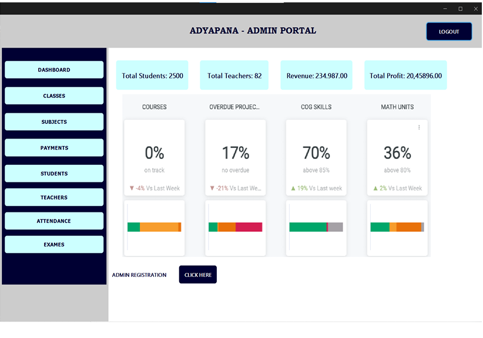
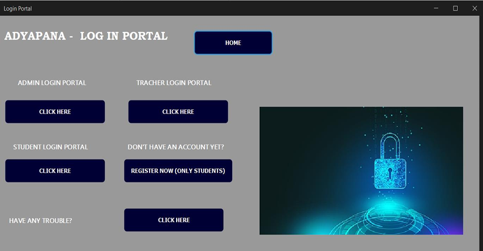
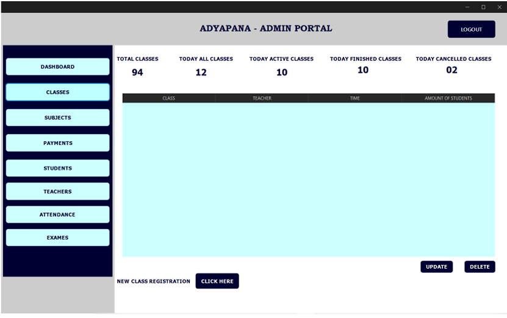
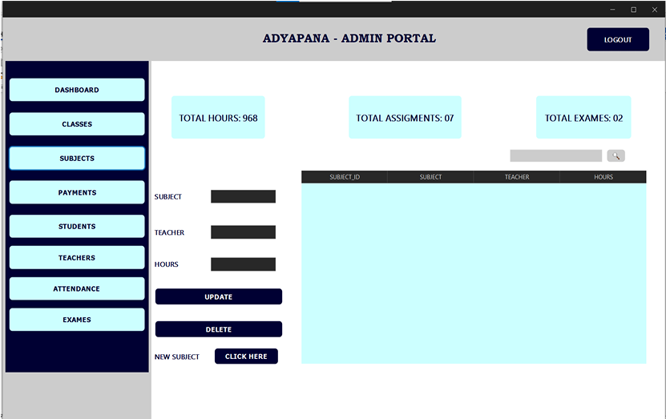
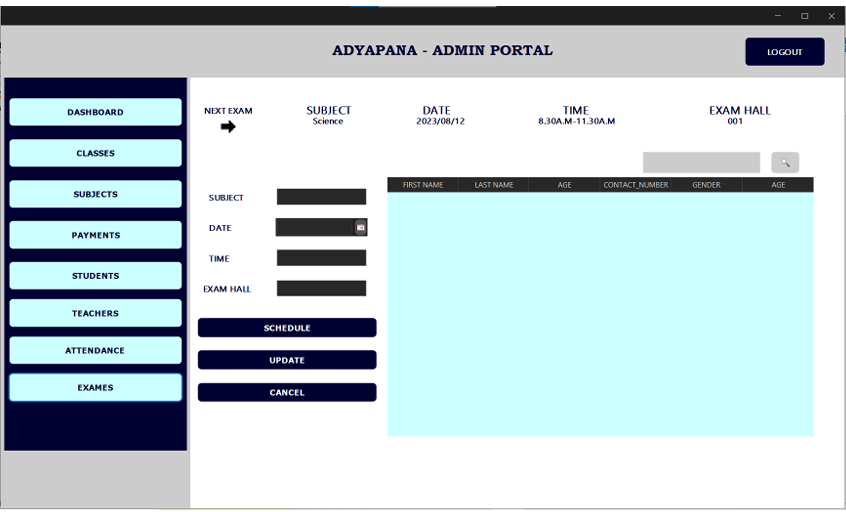
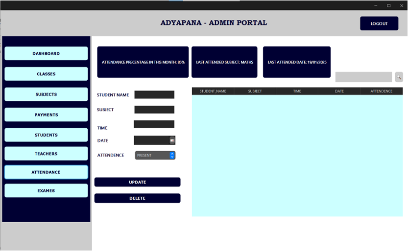
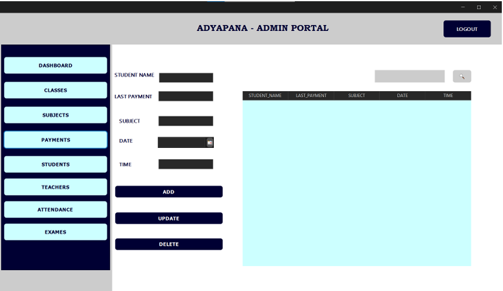

<<<<<<< HEAD
## Screenshots

### Home

### Dashboard

### Log-in Portal

### Classes & Enrollment

### Subject Enrollment

### Exams

### Attendance

### Payment

=======
# AdyapanaSoft - Student Management System

A comprehensive Java Swing desktop application designed for educational institutes to manage students, teachers, classes, and payments efficiently.

## 🚀 Features
* **Multi-User Portals:** Dedicated interfaces for Admins, Teachers, and Students.
* **Dashboard Analytics:** Real-time visualization of total students, revenue, and profit.
* **Registration Systems:** Secure registration for students and staff with validation.
* **Payment Tracking:** Manage student fees and generate digital invoices.
* **Exam Scheduling:** Admin-controlled exam hall and time management.

## 🛠 Tech Stack
* **Language:** Java
* **Framework:** Java Swing (NetBeans GUI Editor)
* **Look & Feel:** FlatLaf (Modern Dark/Light themes)
* **Database:** MySQL
* **Reporting:** JasperReports (for Invoices)

## 📊 Database Design
The system uses a relational database with tables for `student_registration`, `teacher_registration`, `attendance`, `payments`, and more.
>>>>>>> 46d03f8bf00f7e1d6df8e7c36623ffbbdda8d9a7
